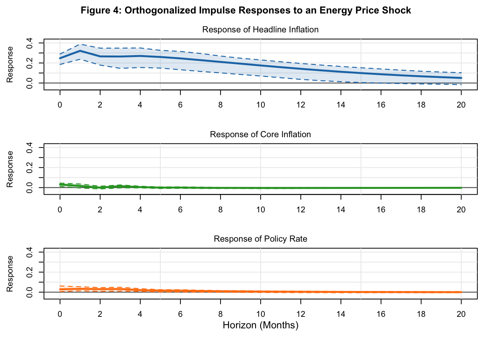
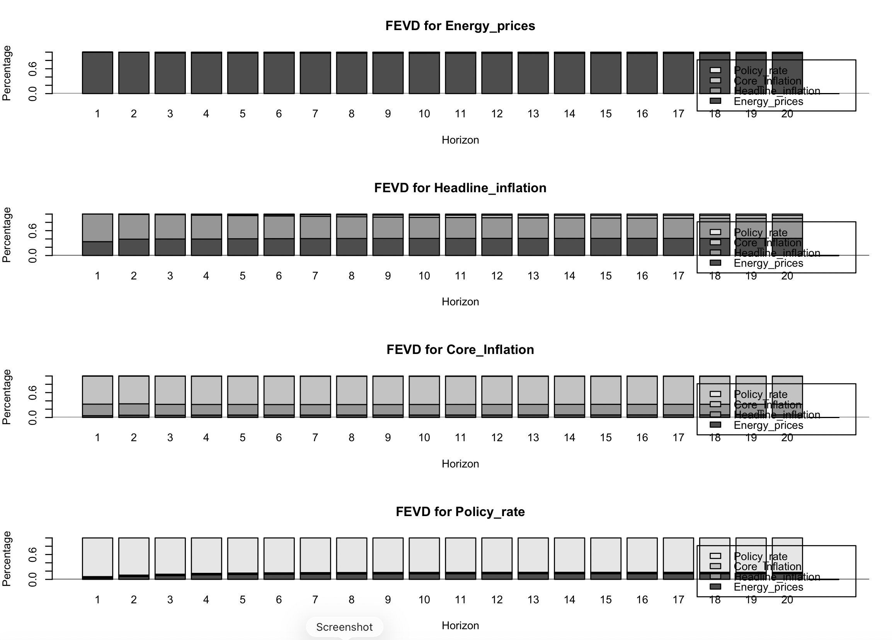

# Are You Wondering Why the Bank of Canada Is not Raising Its Policy Rate Despite the Spike in Energy Prices?

**Author:** Gratien M. Luzolo 
**Date:** July 2026  

## 1. Introduction

Following the recent increase in gasoline and energy prices, many Canadians have wondered why the Bank of Canada has kept its policy rate unchanged. Does the central bank respond immediately to energy price shocks, or does it look through temporary fluctuations unless they spread into persistent underlying inflation?

To explore this question, I conducted an empirical analysis using a Structural Vector Autoregression (SVAR) in R.

## 2. Data

The analysis is based on four monthly Canadian macroeconomic variables covering the period from January 1999 to December 2025:

- Energy Prices: Statistics Canada, Table 18-10-0004-01 (formerly CANSIM 326-0020).
- Headline Inflation: Bank of Canada’s Key Inflation Indicators dashboard.
- Core Inflation: Bank of Canada’s Key Inflation Indicators dashboard.
- Policy Rate: Bank of Canada’s overnight rate obtained from FRED (Federal Reserve Bank of St. Louis), series IRSTCB01CAM156N.

After collecting the data from these sources, I cleaned, harmonized, and combined them into a single dataset.

## 3. Methodology

Using a Structural Vector Autoregression (SVAR) identified through a recursive Cholesky decomposition, I examined whether the Bank of Canada responds directly to energy price shocks or instead waits until these shocks affect underlying inflation before adjusting monetary policy.

This project provided an excellent opportunity to work with real-world macroeconomic time-series data while applying econometric techniques commonly used in monetary policy analysis.

## 4. Key Findings & Graphs

The impulse response functions (IRFs) provide evidence consistent with the look-through hypothesis.

Following an energy price shock, only headline inflation exhibits a significant positive response. This indicates that energy price spikes mainly affect headline inflation, which is consistent with macroeconomic theory since headline inflation includes energy prices in the consumer price index and is therefore directly affected by changes in energy prices.

In contrast, core inflation exhibits only a very weak response, with the confidence bands including zero throughout the forecast horizon. This finding is also consistent with theory, as core inflation excludes volatile items such as food and energy. While an increase in energy prices may generate second-round effects through higher production costs, it does not directly drive core inflation because energy prices are excluded from its construction.

Similarly, the response of the policy rate is statistically insignificant. This suggests that the Bank of Canada does not react directly to temporary energy price shocks. Instead, the results are consistent with the view that the central bank looks through transitory energy price fluctuations when they do not generate persistent increases in underlying inflation.

The FEVD results confirm the IRF findings.

Energy prices are mostly explained by their own shocks, which is expected.

For headline inflation, energy shocks explain a noticeable part of the variation, showing that energy prices matter for headline inflation.

For core inflation, most variation comes from its own shocks, and energy prices play a very small role.

For the policy rate, almost all variation is explained by its own shocks, with very little contribution from energy prices.

## 5. Conclusion

Overall, the empirical evidence supports the look-through hypothesis : energy price shocks significantly affect headline inflation but have little impact on core inflation or the policy rate, suggesting that the Bank of Canada primarily responds to persistent inflationary pressures rather than temporary energy price movements. In monetary policy, energy shocks are initially first-round supply shocks. Central banks only worry when those shocks spread into the wider economy through second-round effects, like higher wages or rising prices for non-energy goods.

This framework may help explain why the Bank of Canada has kept its policy rate unchanged since February 2026, despite higher gasoline and energy prices associated with recent geopolitical tensions in the Middle East.

## 6. Technical Details

- Programming Language: R
- Packages: tidyverse, ggplot2, dplyr, vars, series
- Data Source: Banque of Canada, Statistics Canada, Federal Reserve Bank of St. Louis
- Frequency: Monthly
- Period: January 1999 – December 2025

The complete resources used in this analysis are publicly available for reproduction or extension:
* **Dataset:** [View Raw Data (`data/`)](data/)
* **R Code:** [Inspect Script (`script.R`)](script.R)
